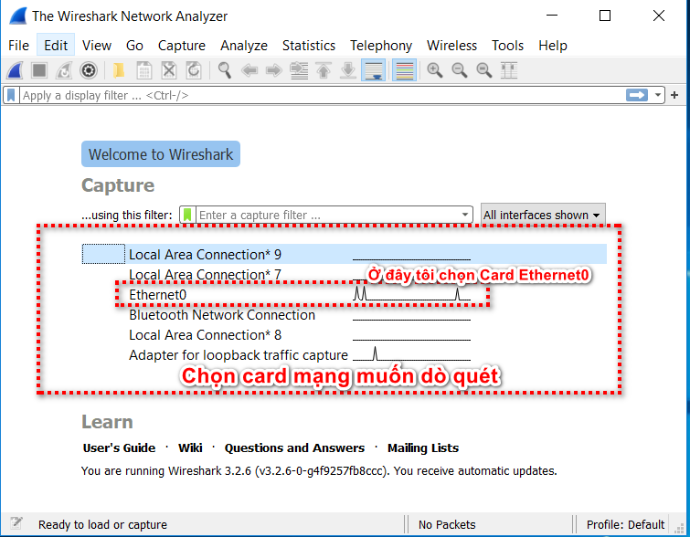
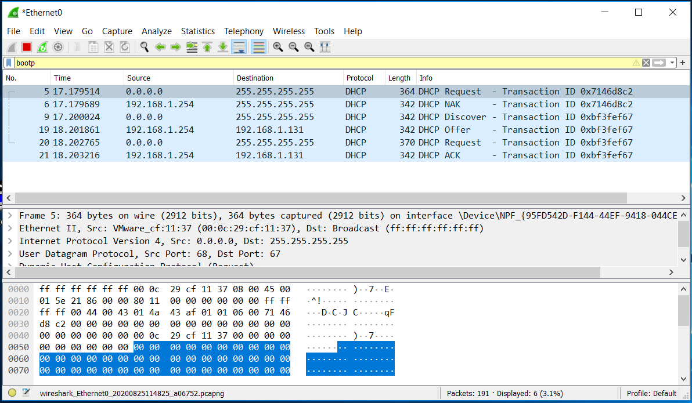

# Giao thức DHCP
## I. DHCP là gì?
## II. Cách thức hoạt động của DHCP
## III. Ưu nhược điểm của DHCP
## IV. Sử dụng wireshark bắt gói tin DHCP

# I. DHCP là gì?

### - DHCP viết tắt của:  Dynamic Host Configuration Protocol.
- DHCP là giao thức tự động cấp phát địa chỉ IP đến các thiết bị trong mạng. 
- Các địa chỉ IP được cung cấp từ giao thức DHCP sẽ cho phép chúng ta truy cập vào internet.
-  Ngoài ra nó cũng đảm bảo không có trường hợp hai hoặc nhiều thiết bị có cùng IP và còn cung cấp các thông tin cấu hình như DNS, subnet mask, default gateway.

# II. Cách thức hoạt động của DHCP

- DHCP gồm 4 gói tin:
```
1. Discover
2. Offer
3. Request
4. Acknowledgement
```


- DHCP về cơ bản khá đơn giản, khi có một thiết bị cần truy cập mạng, nó sẽ gửi yêu cầu từ một router và được router gán cho một địa chỉ IP khả dụng.

- Router hoạt động như một máy chủ DHCP đối với các mô hình mạng nhỏ hoặc hộ gia đình.
-  Đối với các mạng lớn hơn một router không thể quản lý số lượng lớn các thiết bị nên sẽ có một máy chủ chuyên dụng để cấp IP.

- Khi muốn kết nối với mạng thiết bị sẽ gửi yêu cầu **DHCP DISCOVER** đến máy chủ.
 Máy chủ DHCP sẽ tìm địa chỉ IP khả dụng rồi cung cấp cho thiết bị cùng với gói **DHCP OFFER**.

- Sau khi nhận được địa chỉ, thiết bị sẽ phản hồi với máy chủ bằng một gói tin **DHCP REQUEST**. 
- Đây là lúc chấp nhận yêu cầu, máy chủ sẽ gửi tin báo nhận (**ACK**) xác nhận thiết bị đã có IP và thời gian sử dụng IP đến khi có địa chỉ mới.

# Ưu nhược điểm của DHCP
## 1. ƯU điểm

- Giúp các thiết bị kết nối mạng nhanh chóng từ máy tính, laptop, điện thoại, máy tính bảng…

- Quản lý địa chỉ IP một cách khoa học, tránh trường hợp trùng IP trên nhiều, đảm bảo cấu hình tự động cho mọi thiết bị kết nối mạng.

- Quản lý địa chỉ IP và các tham số TCP/IP dễ dàng qua các trạm.

- Các nhà quản trị mạng có thể thay đổi cấu hình và thông số của IP để nâng cấp cơ sở hạ tầng.

- Các thiết bị có thể di chuyển tự do từ mạng này sang mạng khác và nhận IP mới tự động.

## 2. Nhược điểm

- Việc sử dụng IP động của DHCP không phù hợp với các thiết bị cố định và cần truy cập liên tục như máy in, file server.

- DHCP thường chỉ được sử dụng tại các hộ gia đình hoặc mô hình mạng nhỏ.

# IV. Sử dụng wireshark bắt gói tin DHCP
- Bài lab dưới đây sẽ cho chúng ta thấy chi tiết quá trình DCHP xử lý của DHCP

- Sau khi cài Wireshark, chúng ta mở chương trình lên.



- Kết quả các gói tin chúng ta thu được




Qua bài viết các bạn hiểu rõ hơn về DHCP
Trân trọng!
