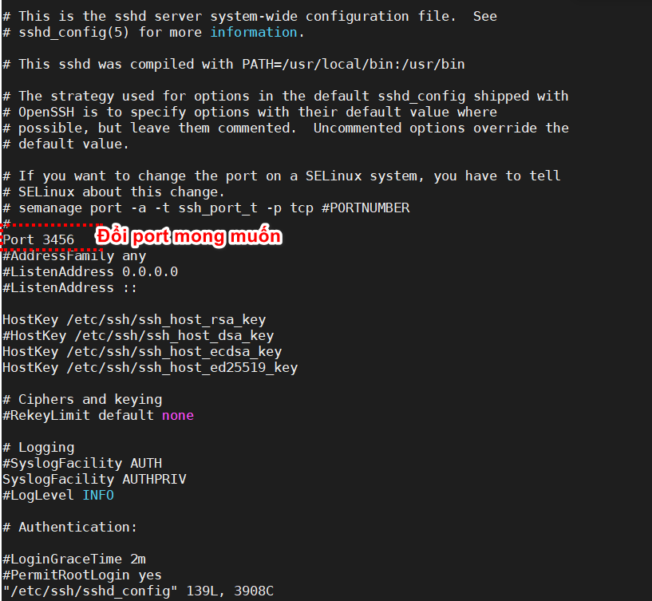
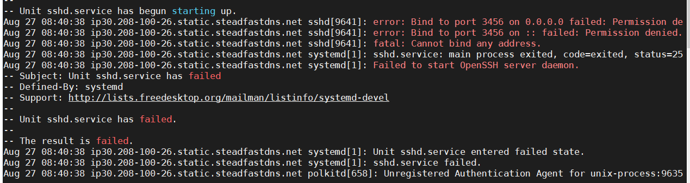
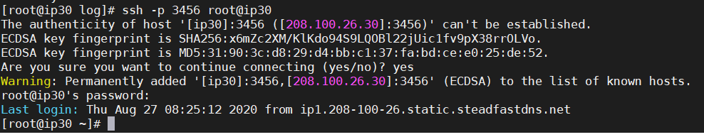

# Hướng dẫn đổi port SSH mặc định trên CentOS 7 Minimal

### Đổi port SSH mặc định để bảo mật hệ thống, làm khó khăn hơn cho các script độc hại hoặc nhân viên không mong muốn cố gắng để đăng nhập vào máy chủ CentOS của bạn. Từ CentOS 7 việc đổi port SSH có đôi chút khác biệt với các hệ điều hành cũ, để thực hiện đổi port SSH trên CentOS 7 bạn thực hiện như sau:

- Cấu hình SSH đổi port mong muốn:
```
 vi /etc/ssh/sshd_config
```
- Port Mặc định là port 22 bạn sửa thành port mong muốn:

VD: ở đây muốn mở port 3456 cho dịch vụ SSH



- Mở port firewall
```
firewall-cmd --add-port=3456/tcp --permanent
firewall-cmd --reload
```
- Restart sshd service
```
systemctl restart sshd
```
### Nếu restart ssh services bị lỗi - Chúng ta Fix như sau
```
journalctl -xe
```


- Cài đặt semanage lên CentOS 7
- Semanage là 1 phần gói tin policycoreutils-python ,
```
yum
 install policycoreutils-python
```
- Chúng ta cần nói cho SElinux về việc thay đổi port ssh sang 3456
```
semanage port -a -t ssh_port_t -p tcp 3456
```
Ngay bây giờ SELInux cho phép sshd lắng nghe 2 port:
```
semanage port -l | grep ssh
```
- Result
``ssh_port_t  tcp      3456, 22
``

Chúng ta cần cài gói tin sau
```
yum whatprovides semanage
```
```
yum install -y policycoreutils-python
```
- Kiểm tra xem đã SSH port mới được hay chưa
```
ssh -p 3456 root@ip30
```
Kết quả chúng ta đã thành công


Chúc các bạn thành công!
