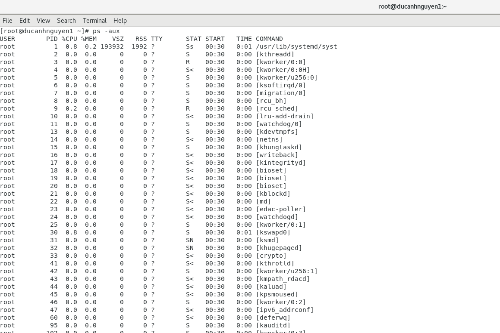
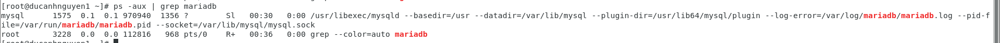
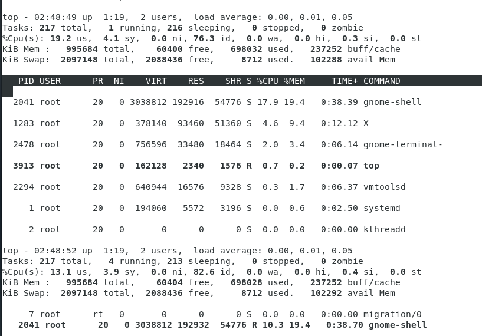

## Hướng dẫn check RAM CPU cho SQL , HTTP cùng 1 số lệnh tiện ích khác

# 1. Cách check Ram, CPU của service.

- Chúng ta sử dụng lệnh để list tất cả thông tin chiếm dụng tài nguyên RAM, CPU
của Services
```
ps -aux
```
- Đây là kết quả



- Để kiểm tra riêng các Services chúng ta kết hợp lệnh Grep (lệnh đường ống) để lọc

Dưới đây tôi muốn check thông tin của Mariadb thì làm như sau
```
ps -aux grep | mariadb
```
Và đây là kết quả



Tôi muốn check nginx
```
ps -aux grep | nginx
```
Kết quả


# 2. Lệnh Top
### Dùng để hiển thị các process chiến nhiều tài nguyên nhất

```
top
```
Và đây là kết quả



Trong bài viết sau tôi sẽ chia sẻ nhiều tiện ích khác.
Cảm ơn các bạn!
