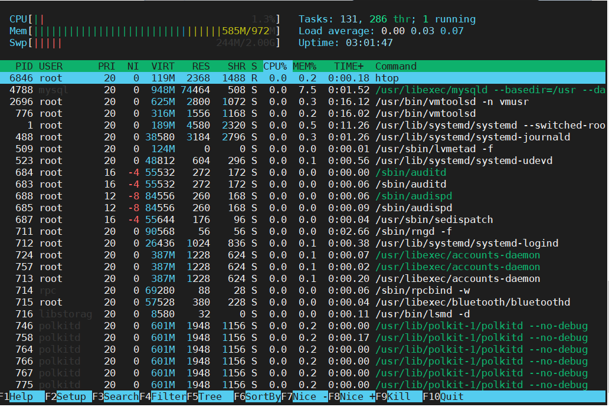
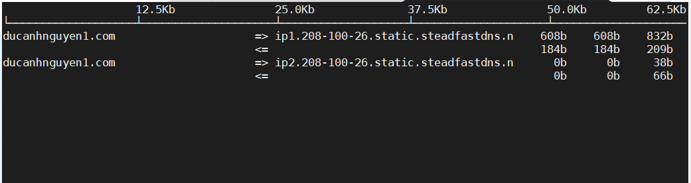
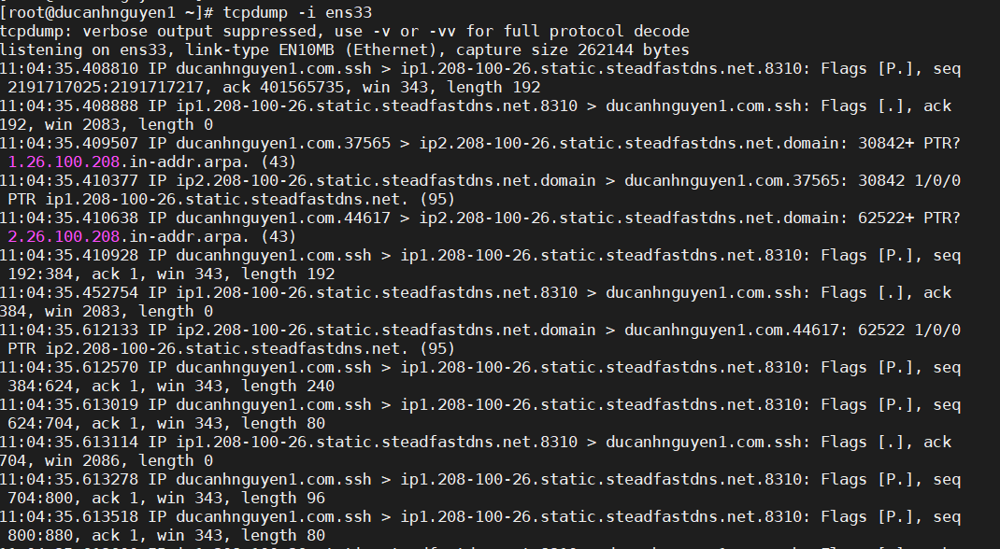
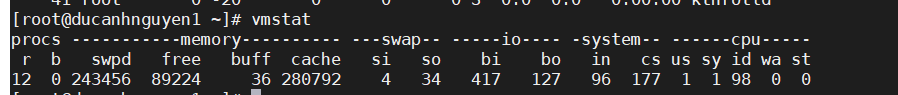

# Trong bài  này tôi sẽ hướng dẫn các bạn kiểm tra tài nguyên của máy chủ

## 1. Htop - Linux Process Monitoring
## 2. Iftop - Network Bandwidth Monitoring
## 3. Iotop – Monitor Linux Disk I/O
## 4. Tcpdump – Network Packet Analyzer
## 5. VmStat – Virtual Memory Statistics

# 1. Htop - Linux Process Monitoring
- Cài đặt
```
yum instal htop
```
- Nhập lệnh để Monitor
```
htop
```
- Kết quả



# 3. Iftop - Network Bandwidth Monitoring

- Cập nhật Linux Kernel
```
yum update kernel python python-ctypes -y
```
- Cài đặt Iftop
```
yum instal iftop
```
- Nhập lệnh
```
iftop
```
- Kết quả



# 4. Tcpdump – Network Packet Analyzer
- Cài đặt Tcpdump
```
yum install tcpdump
```
- Monitor card mạng
```
tcpdump -i ens33
```
- Kết quả



# 5. VmStat – Virtual Memory Statistics

- Cài gói Epel
```
yum -y install epel-release
```
- Cài đặt VmStat
```
yum -y install vnstat
```
- Nhập lệnh 
```
vnstat -u -i ens33
```
- Kết quả:



# 6. Ngoài ra chúng ta có thể sử dụng các lệnh sau để kiểm tra tài nguyên

- Check Memory
```
free -m  
```
- Check Disk
```
fdisk -l
```

Chúc các bạn thành công!
