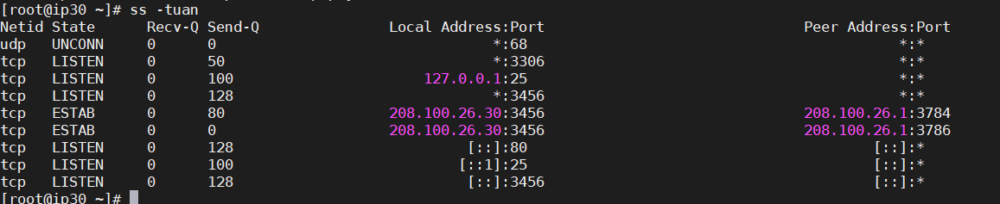
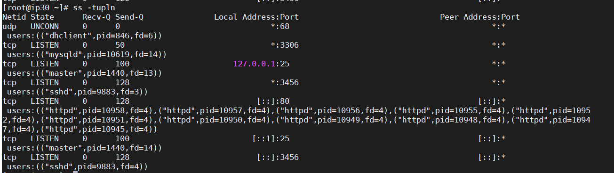
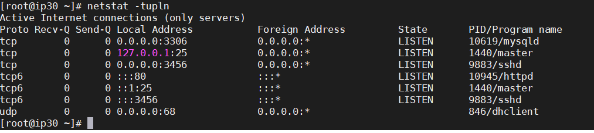
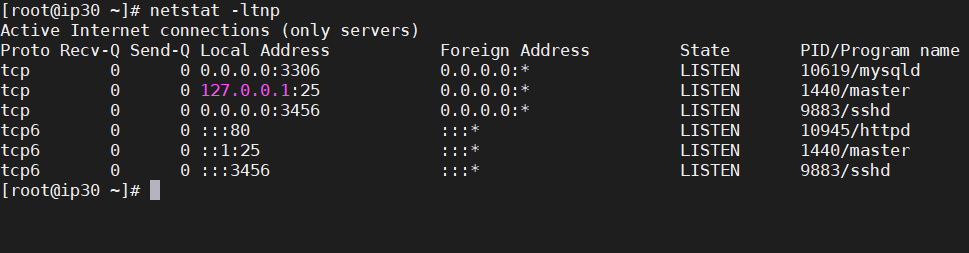
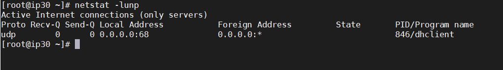

# Kiểm tra trạng thái Port cho CentOs 

- Lệnh ss
```
ss -tuan
```


```
ss -tupln
```


- Lệnh Nestat

```
netstat -tupln

```


- Kiểm tra port TCP đang mở
```
netstat -ltnp
```


- Kiểm tra port UDP đang mở


