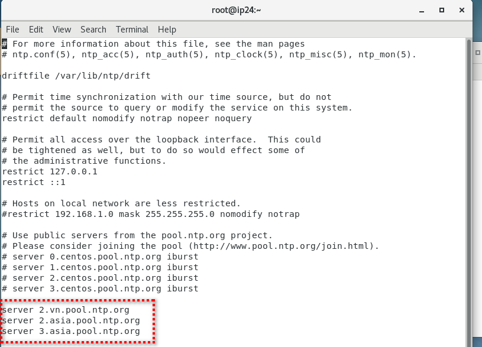
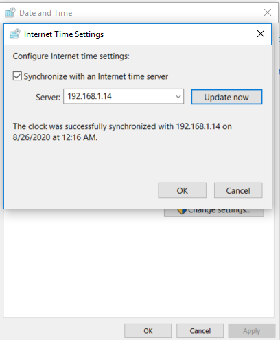

# Hướng dẫn cài đặt NTP Server
##  Install and configure NTP

### 1.  Cài đặt NTP trên CentOS 7/ RHEL 7
```
yum Install ntp
```
### 2. Sau khi cài đặt xong chúng ta vào NTP Public Pool Server
Chọn khu vực nơi bạn đặt máy chủ thực tế.
Sau đó tìm vị trí quốc gia theo danh sách NTP.


File cấu hình
```
vi /etc/ntp.conf
```
Chỉnh sửa theo giờ quốc gia và khu vực
Ở đây tôi chỉnh sửa time Việt Nam



### 3. Chúng ta thực hiện thêm port của NTP đối với dịch dụ firewalld.
- Dịch vụ NTP sử dụng cổng UDP 123 trên lớp Transport Layer tầng 4 trong mô hình OSI.

```
firewall-cmd --add-service=ntp --permanent
firewall-cmd --reload
```
Khởi động lại NTP
```
systemctl restart ntpd
```

### 4. NTP trên Client



Chúc anh em thành công!