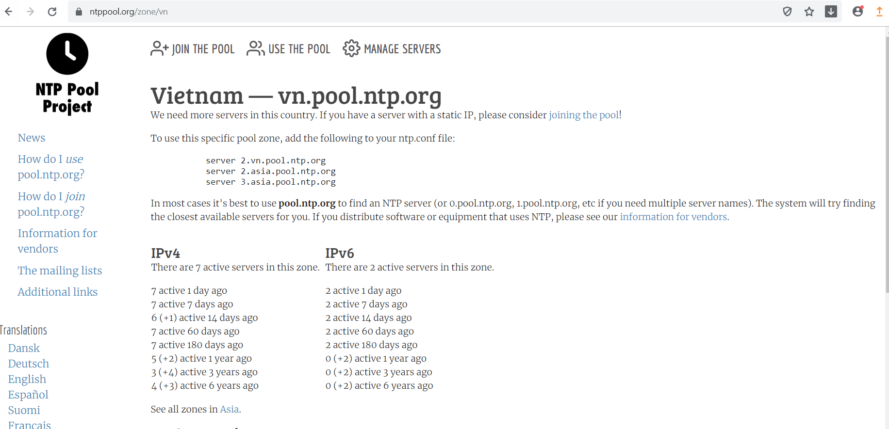

# Hướng dẫn cài đặt NTP Server
##  Install and configure NTP
### 1.  Cài đặt NTP trên CentOS 7/ RHEL 7
```
yum Install ntp
```
### 2. Sau khi cài đặt xong chúng ta vào NTP Public Pool Server
Chọn khu vực nơi bạn đặt máy chủ thực tế.
Sau đó tìm vị trí quốc gia theo danh sách NTP.



File cấu hình
```
vi /etc/ntp.conf
```