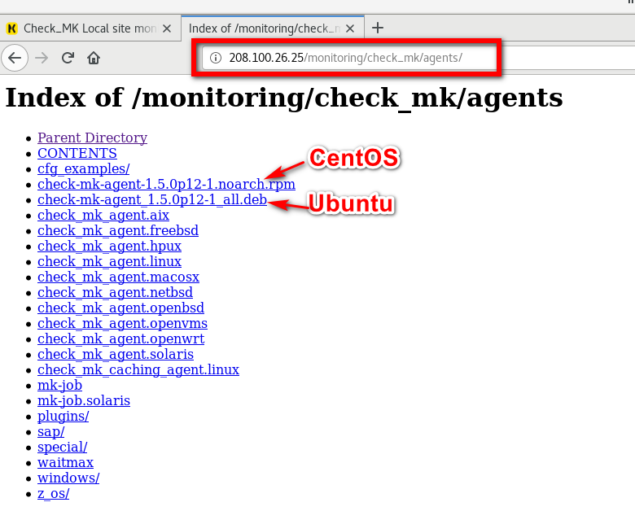

# Install Check_MK Agent.
```

- Disable SELinux
```
getenforce
```
Sửa cấu hình SELinux
```
vim /etc/sysconfig/selinux
Change SELINUX=enforcing to SELINUX=disabled\
```
Sau đó reboot
```
Reboot
```
- Thêm EPEL Repository
```
yum install epel-release
```
- Cài đặt check_Mk Agent

http://IP_server_checkmk/monitoring/check_mk/agents
```


Tải file về
```
http://208.100.26.25/monitoring/check_mk/agents/agent-mk-agent-1.5.op12.noarch.rpm
```
Cài đặt check_mk Agent
```
yum install check-mk-agent-1.6.0p10-1.noarch.rpm
```
yum install agent-mk-agent-1.5.op12.noarch.rpm
```

Chúc các bạn thành công!