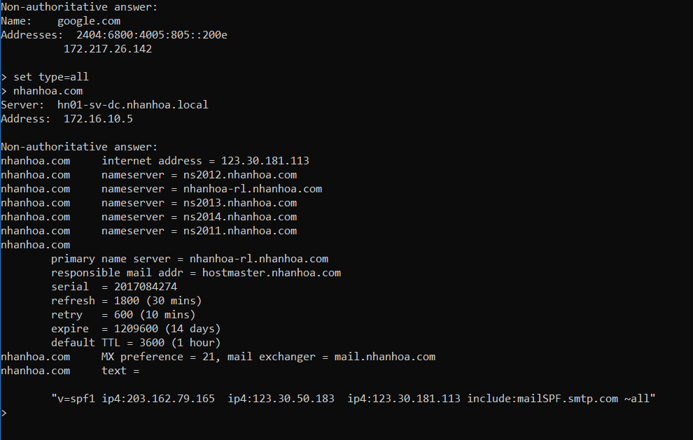

# Các loại bản ghi trên DNS

## I. DNS là gì?
## II. DNS có những loại bản ghi ?

# I. DNS là gì
- Giống như một bức thư ở bưu điện, DNS cần một địa chỉ để xác định vị trí của một trang web trong hệ thống internet. 
DNS là tên viết tắt của cụm từ Domain Name System (hệ thống tên miền)
- Giống như một bức thư ở bưu điện, DNS cần một địa chỉ để xác định vị trí của một trang web trong hệ thống internet. DNS là tên viết tắt của cụm từ Domain Name System (hệ thống tên miền), nó là chìa khóa chủ chốt của các dịch vụ mạng như mail server, web server… 
Bài viết này sẽ giải thích các phần khác nhau của DNS và mục đích của mỗi loại bản ghi.

### Tên máy chủ (Name Server)
Bản ghi tên máy chủ thường được viết tắt là NS records là những bản ghi chính trong DNS,
nó sẽ tạo một địa chỉ IP trả về tên miền trên máy chủ. 
Nếu không phải là tên máy chủ, bạn cần phải sử dụng một địa chỉ IP để kéo lên trang web,
điều này sẽ làm cho địa chỉ trang web khó nhớ hơn.

VD:
Ví dụ địa chỉ IP:
https://123.30.181.113
Chuyển đến tên miền:
https:// nhanhoa.com

# II. DNS có những loại bản ghi?
## 1. Bản ghi địa chỉ (A records)

- Bản ghi địa chỉ thường được viết tắt là A records là một mặt 
khác của tên máy chủ,
bản ghi địa chỉ sẽ trỏ tên miền tới địa chỉ IP của máy chủ,
giúp nó chuyển đến địa chỉ IP đã được chỉ định.

- Bản ghi A được sử dụng cho website và các ứng dụng trên nền tảng web.
## 2. CNAME

- Bản ghi Canonical Name thường được viết tắt là CNAME dùng để tạo bí danh cho một tên miền, thông thường cách tốt nhất là nó sẽ trỏ tên miền với một subfolder tới một tên miền con (subdomain) nằm dưới tên miền chính.

## 3. Bản ghi MX (MX records)
- MX là tên viết tắt của Mail Exchange, là các bản ghi chính gửi trực tiếp email cho một tên miền.
Các bản ghi này hoạt động kết hợp với bản ghi địa chỉ (A records) và bản ghi tên máy chủ (NS records)
hướng các email nhận được cho một tên miền đến các máy chủ mail thích hợp.
Thông thường, các bản ghi MX được ưu tiên với một số thích hợp và nó sẽ chỉ ra loại máy chủ thư nào nên được sử dụng trong danh sách liệt kê.
- Bản ghi của nhanhoa.com

## 4. Bản ghi PTR (PTR records)

- Bản ghi PTR được sử dụng để chuyển IP tới tên miền và ngược lại.
## 5. Bản ghi TXT

- Bản ghi văn bản hay còn gọi là bản ghi TXT là các bản ghi tùy chỉnh chứa dữ liệu mà chúng ta có thể hiểu được.
Bản ghi TXT có thể sử dụng cho một số mục đích xác minh quyền sở hữu tên miền của các dịch vụ như Google Apps.

## 6. Bản ghi SRV

- Là các bản ghi dịch vụ (service) được sử dụng để trỏ từ một tên miền này đến một tên miền khác sử dụng một cổng (port) riêng. 
Bản ghi SRV cho phép các dịch vụ cụ thể như VOIP hoặc IM chuyển đến một vị trí riêng.

## 7. Bản ghi AAA

- Một bản ghi AAA trỏ một tên miền hoặc một tên miền phụ tới một địa chỉ IPv6 
giống cách mà bản ghi địa chỉ (A records) thực hiện. 
Tuy nhiên, bản ghi A chỉ sử dụng địa chỉ IPv4.
