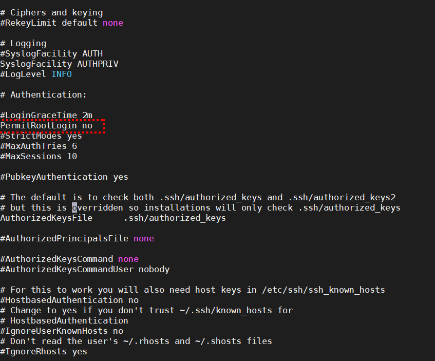
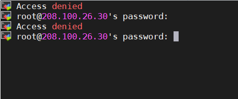

# Cấm truy cập ssh bằng tài khoản root
## SSH Root Login

- Để vô hiệu hóa đăng nhập root, mở tập tin cấu hình ssh /etc/ssh/sshd_config
```
Vi / etc / ssh / sshd_config
```
Tìm kiếm cho các dòng sau đây trong tập tin.
```
#PermitRootLogin no
```
Loại bỏ các '#' từ đầu dòng.
```
PermitRootLogin no
```


- Khởi động lại dịch vụ SSH daemon.
```
/etc/init.d/sshd restart
```

Bây giờ cố gắng để đăng nhập với người dùng root, bạn sẽ nhận được lỗi "Access Denied".

