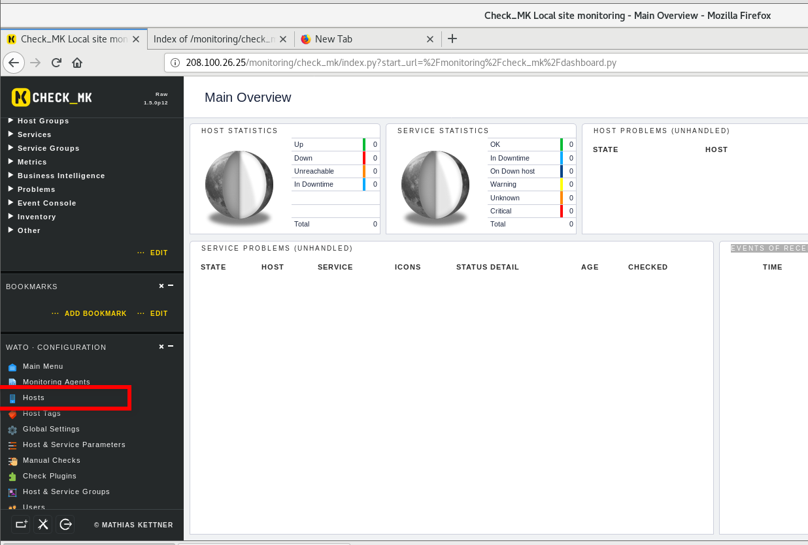
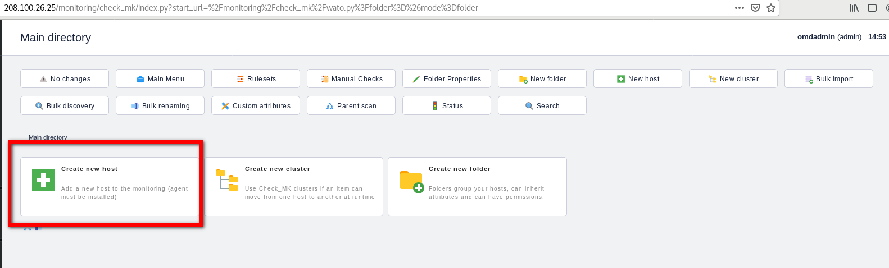
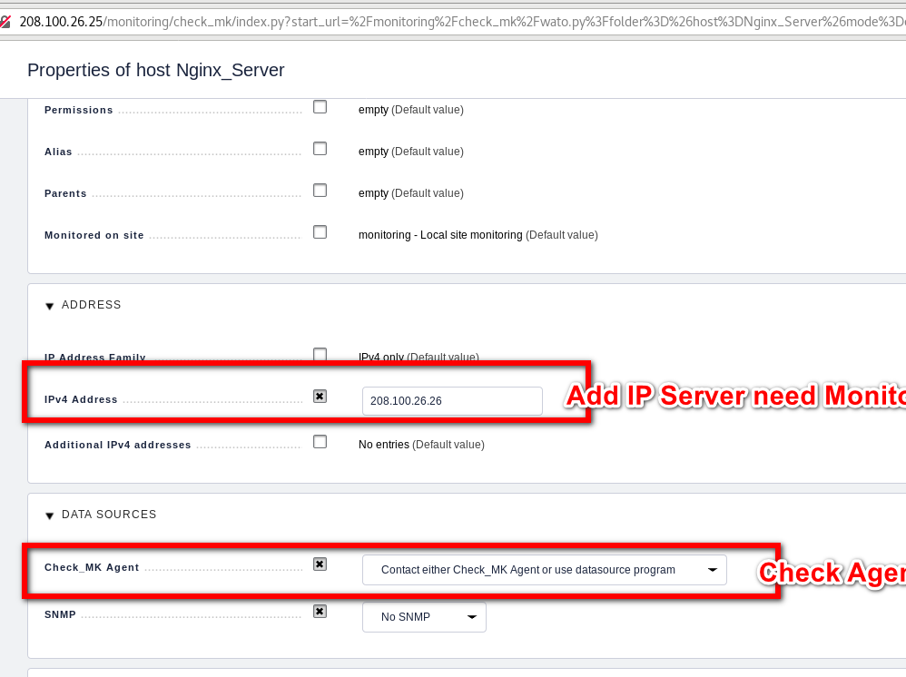
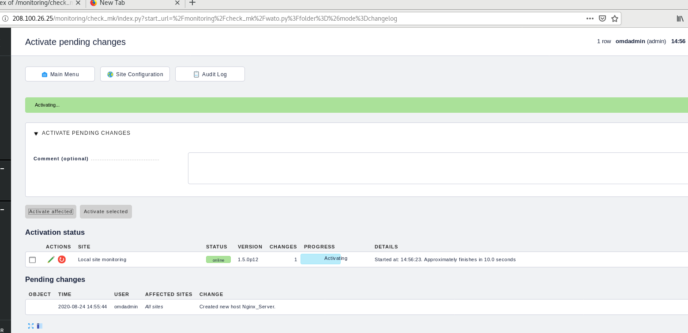

# Trong bài này tôi sẽ hướng dẫn các bạn thêm host vào Check MK

## Step 1
Chọn Mục Host

## Step 2
Chọn Create New Host

## Step 3
Hostname : Tên server của bạn
IPv4 Address : IP server cần monitor
Tích và mục Check Mk Agent

## Step 4
Sau khi add IP, check Mk sẽ tiến hành scan Server cần monitor
Chúng ta chọn:  Activate affected

## Step 5

Kết quả

Chúc các bạn thành công
