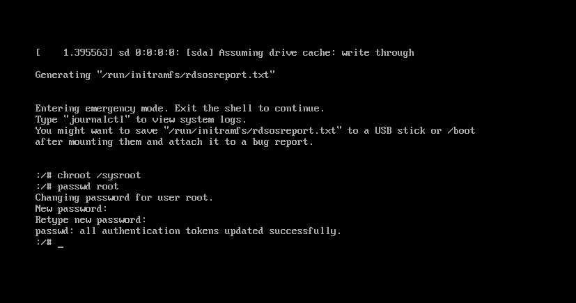

# Hướng dẫn Reset Password root bằng Single mode trên CeotOS7

## 1. Khởi động lại hệ thống, mở trình Edit 'grub2'

- Khởi động lại hệ thống và tinh chỉnh chế độ GRUB2 ở màn hình boot GRUB2.

- Bấm nút ESC để màn hình dừng lại, sau đó ấn nút ‘e’ để thực hiện chỉnh sửa.


## 2. Chỉnh thông đường dẫn.

- Thêm vào dòng 
```
rw init=/sysboot/bin/sh
```


- Sau khi sửa bấm tổ hợp phím :Control + X  vào single user mode


## 3. Lệnh đổi Password

- Truy cập system
```
chroot /sysroot
```
- Reset password tài khoản : root
```
passwd root
```


- Cập nhật  thông tin Selinux
```
touch /.autorelabel
```
- Thoát chroot
```
exit
```
- Khởi động lại hệ thống
```
reboot
```

Chúc các bạn thành công~