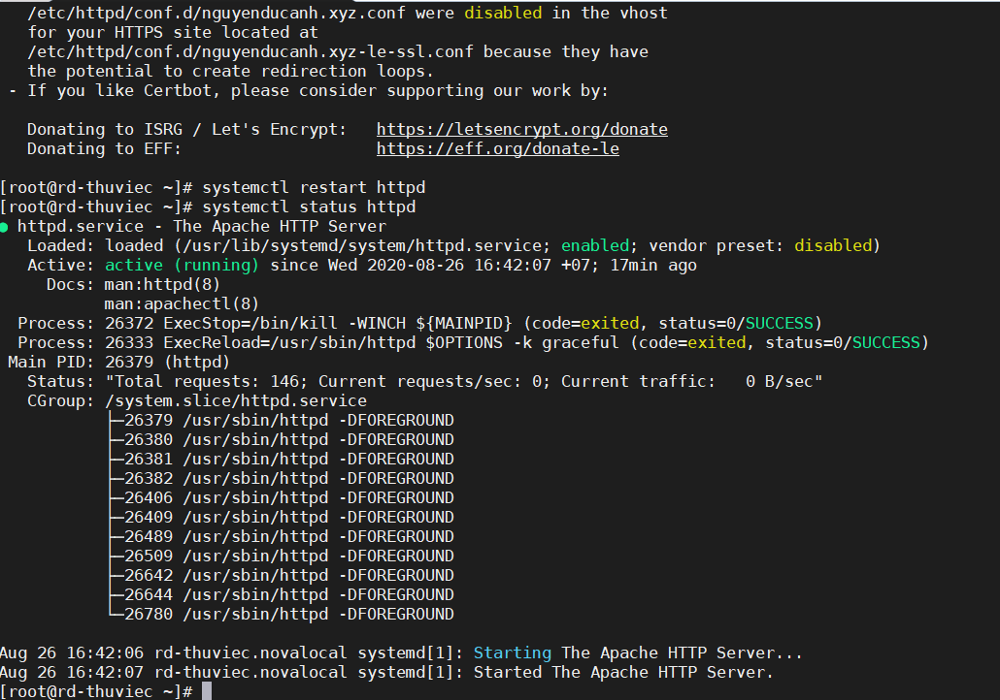
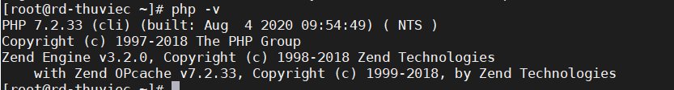
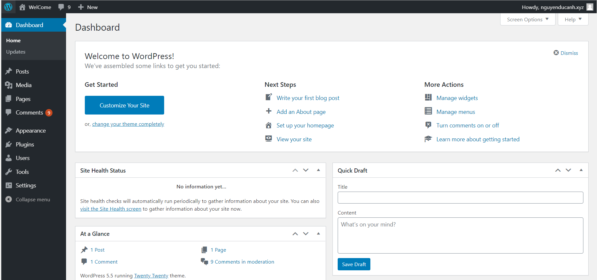

# Cài đặt LAMP - WordPress - SSL
## 1. Cài đặt LAMP
## 2. Cài đặt WordPress

# 1. Cài đặt LAMP
## 1. Cài đặt httpd (apache)
```
yum Install httpd
```
- Khởi động services
```
systemctl start httpd
```
- Kiểm tra trạng thái hoạt động của apache
```
systemctl status httpd
```
- Cho phép services khởi động cùng OS
```
systemctl enable httpd
```


- Mở port firewall
```
firewall-cmd --zone=puclic --add-port=80/tcp --permanent
firewall-cmd --zone=puclic --add-port=443/tcp --permanent
firewall-cmd -- reload
```
## 2. Cài đặt mariaDb

- Cài đặt mariaDb
``
yum -y install mariadb mariadb-server
``
- Khởi động mariadb service:
```
systemctl start mariadb
```
- Đặt mật khẩu mật khẩu cho quyền root của cơ sở dữ liệu:
```
sudo mysql_secure_installation
```
- Cho phép mariadb để khởi động cùng hệ thống:
```
systemctl enable mariadb
```
- Run MySQL security script
``` 
sudo mysql_secure_installation
```
Chọn các bước như bên dưới
```
Set root password? [y/n] Y
New password: Type in a password you would like to use
Re-enter new password: Retype the password from the previous field
Remove anonymous users? [y/n] Y
Disallow root login remotely? [y/n] Y
Remove test database and access to it? [y/n] Y
Reload privilege tables now? [y/n] Y
```

## 3. Cài đặt phép
3. Cài đặt PHP
- Trong bài này tôi cài bản PHP 7.2
```
rpm -Uvh http://rpms.remirepo.net/enterprise/remi-release-7.rpm
```
- Cài yum-utils vì chúng ta cần tiện ích yum-config-manager để cài đặt:
``
yum -y install yum-utils
```
- Tiến hành cài đặt php. Ở đây ta cần lưu ý về phiên bản cài đặt như sau:

Bản 7.0:
```
yum-config-manager --enable remi-php70
yum -y install php php-opcache php-mysql
```
Bản 7.1:
```
yum-config-manager --enable remi-php71
yum -y install php php-opcache php-mysql
```
Bản 7.2:
yum-config-manager --enable remi-php72
yum -y install php php-opcache php-mysql

Bản 7.3:
```
yum-config-manager --enable remi-php73
yum -y install php php-opcache php-mysql
```

Sau khi cài đặt xong, thực hiện restart lại apache:
```
systemctl restart httpd
```
Tiến hành kiểm tra kết quả. Ta thêm file sau:
```
echo "<?php phpinfo();?>" > /var/www/html/info.php
```
- Check version PHP
```
php -v
```
- Kết quả
```

```
- Restart lại apache:
```
systemctl restart httpd
````
Nhập url địa chỉ sau trên trình duyệt
```
<địa chỉ ip>/info.php
```

# 2. Cài đặt WordPress

## 1. Cài môi trường
```
yum install -y tar git wget curl
```
## 2. Tạo database và tài khoản cho WordPress

- Đăng nhập vào bằng tài khoản root MariaDb
```
mysql -u root -p
```
- Nhập mật khẩu root của MariaDb. Tôi đặt tên database là **Roony**
```
create database roony;
```
- Phân quyền cho user có quyền thao tacs với database **roony**
```
CREATE USER 'roony'@'localhost' IDENTIFIED WITH mysql_native_password BY 'passwd@@@12345';
```
```
GRANT ALL PRIVILEGES ON roony.* TO roony@localhost IDENTIFIED BY 'passwd@@@12345';
```
- Xác thực lại thay đổi về quyền và thoát ra
```
FLUSH PRIVILEGES;
exit
```

## 3.  Cài đặt wordpress

- Ta truy cập vào thư mục /var/ww/html/ sau đó tiến hành download WordPres từ internet vào thư mục này:
```
cd /var/www/html
wget https://wordpress.org/latest.tar.gz
```
Sau khi tải về nó là 1 tập tin nén, ta tiến hành giải nén tập tin:
```
tar xzvf latest.tar.gz
```
- Tiếp theo, ta sao chép file và thư mục trong wordpress vào thư mục html rồi tiến hành đổi tên file wp-config-sample.php:
```
mv wordpress/* /var/www/html/
mv wp-config-sample.php wp-config.php
```
- Bây giờ ta sẽ cấu hình file wp-config.php để điền vào các thông tin để wordpress có thể truy cập cơ sở dữ liệu của mình.

- Nhập vào tên của cơ sở dữ liệu đã tạo cho wordpress trong MariaDB :
```
sed -i -e "s/database_name_here/"roony"/g" /var/www/html/wp-config.php
```
- Thay username bằng tên user đã tạo cho cơ sở dữ liệu wordpress :
```
sed -i -e "s/username_here/"roony"/g" /var/www/html/wp-config.php
```
- Thay password bằng pass của user name trên:
```
sed -i -e "s/password_here/"passwd@@@12345"/g" /var/www/html/wp-config.php
```
## 4. Phân quyền cho thư mục

- Phân quyền thư mục wordpress cho user apache để cho user này được phép tạo các thư mục và lưu các tệp tải lên:
```
chown -R apache:apache /var/www/html/*
chmod -R 755 /var/www/html/*
```
- Khởi động lại dịch vụ http
```
systemctl restart httpd
```

## 5. Kiểm tra hoạt động trang web

- Sau khi install, nhập vào user và password vừa tạo để vào giao diện quản trị trang web, nó trông như sau:



Chúc các bạn thành công!