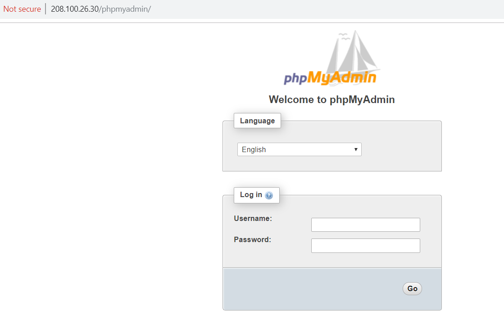
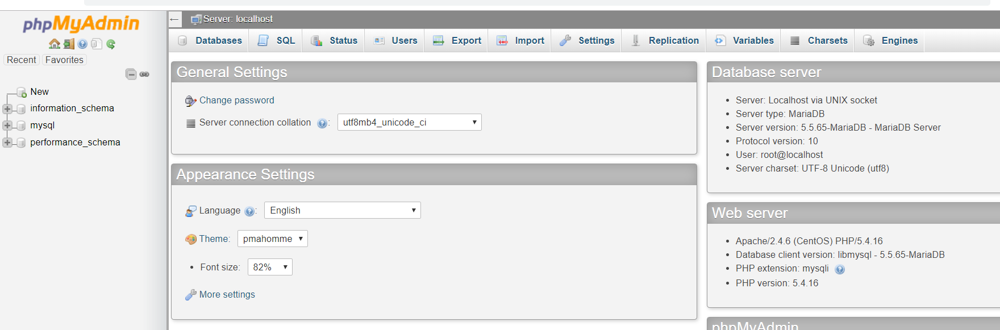

# Cài đặt phpMyadmin

- Mặc định, MySQL hoặc MariaDB server sẽ được quản trị bằng giao diện dòng lệnh (command line interface). Nếu cảm thấy bất tiện với điều này, bạn có cài đặt PhpMyAdmin – một công cụ quản trị database bằng giao diện web (Web Interface) rất thân thiện và phổ biến.

- PhpMyAdmin là một mã nguồn mở nên cần hoạt động trên môi trường đã cài đặt sẵn LAMP Stack.

 - Cài đặt Epel
 ```
 sudo yum install epel-release
 ```
 - Cài đặt phpmyadmin
 ```
 yum install phpmyadmin

 ```
 - Cấu hình PhpMyAdmin chấp nhận kết nối remote đến database server từ mọi địa chỉ IP, bạn mở và điều chỉnh lại file phpmyadmin.conf.
```
 vi  /etc/httpd/conf.d/phpmyadmin.conf
```
Sửa như hình bên dưới


- Nhập địa chỉ server của bạn len trình duyệt
```
<địa chỉ IP>/phpmyadmin
```
- Nhập thông tin vào các TextBox



- Kết quả


Chúc các bạn thành công!