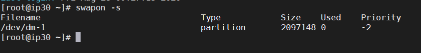
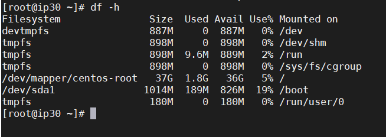
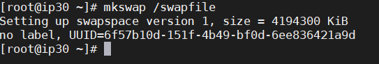
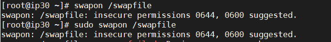
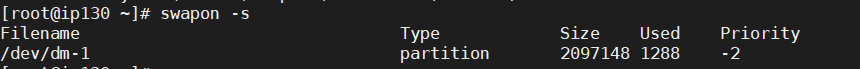
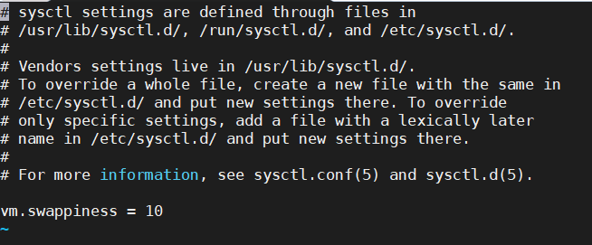

# Hướng dẫn tạo và kích hoạt Swap cho CentOs - Ubuntu

## I. Swap là gì
## II. Kiểm tra - cấu hình Swap
### 1. Tạo Swap
### 2. Config Swappiness
## III. Thay đổi dung lượng Swap

# I. Swap là gì?

- Swap là khái niệm bộ nhớ ảo được sử dụng trên hệ điều hành Linux. Khi VPS/Server hoạt động, nếu hết RAM hệ thống sẽ tự động sử dụng một phần ổ cứng để làm bộ nhớ cho các ứng dụng hoạt động.

- Với những server không có swap, khi hết RAM hệ thống thường tự động stop service MySQL, do đó hay xuất hiện thông báo lỗi Establishing a Database Connection.

- Do sử dụng ổ cứng có tốc độ chậm hơn RAM, nhất là với những server dùng ổ cứng thường không dùng SSD, do đó không nên thường xuyên sử dụng Swap sẽ làm giảm hiệu năng hệ thống. Nếu tình trạng hết RAM hay xảy ra, bạn hãy tối ưu server, tăng cache và nâng cấp bổ sung thêm RAM.

- Với các VPS dùng công nghệ ảo hóa OpenVZ, có thể bạn sẽ không tạo được swap do hệ thống đã tự động kích hoạt sẵn.

## II. Kiểm tra - cấu hình Swap

### 1. Check Swap

- Trước khi tiến hành tạo file swap cần kiểm tra xem hiện tại hệ thống đã kích hoạt swap hay chưa bằng cách chạy:
```
swapon -s
```
- Nếu không có thông tin gì hoặc trả về như hình dưới chứng tỏ server chưa có swap và bạn có thể tạo.



### 2. Check dung lượng trống
- Kiểm tra dung lượng trống
```
df -h
```


### 3. Create Swap

- Chạy lệnh dd. Tôi tạo 2GB swap (count=2048k)
```
sudo dd if=/dev/zero of=/swapfile bs=2048 count=2048k
```

Lệnh trên sẽ tạo swap có dung lượng 1Gb. Bạn có thể thay count=2048k bằng count=4096k… để tạo swap dung lượng 2Gb. Dung lượng Swap tối đa chỉ nên gấp đôi RAM vật lý.


- Tạo phân vùng Wsap
```
mkdir /swapfile
```


- Kích hoạt swap
```
swapon /swapfile
```


- Đoạn này có thể gặp thông báo warning insecure permissions 0644, nhưng không vấn đề gì cả. Chúng ta sẽ chỉnh lại ở bước sau.

– Kiểm tra lại tình trạng swap bạn sẽ thấy như sau:
```
swapon -s
```


- Thiết lập swap tự động được kích hoạt mỗi khi reboot
```
echo /swapfile none swap defaults 0 0 >> /etc/fstab
```
– Bảo mật file swap bằng cách chmod
```
chown root:root /swapfile 
chmod 0600 /swapfile
```

### 4. 4. Config Swappiness

**Swappiness** là mức độ ưu tiên sử dụng swap, khi lượng RAM còn lại bằng giá trị của swappiness (tính theo tỷ lệ phần trăm) thì swap sẽ được sử dụng.
**Swappiness** có giá trị trong khoảng 0 – 100.

- swappiness = 0: swap chỉ được dùng khi RAM được sử dụng hết.
- swappiness = 10: swap được sử dụng khi RAM còn 10%.
- swappiness = 60: swap được sử dụng khi RAM còn 60%.
- swappiness = 100: swap được ưu tiên như là RAM.

Do tốc độ xử lý dữ liệu trên RAM cao hơn nhiều so với Swap, do đó bạn nên đặt giá trị này về gần với 0 để tận dụng tối đa sức mạnh hệ thống. Tốt nhất nên chỉnh về 10.

– Kiểm tra mức độ sử dụng file swap của hệ thống bằng cách chạy dòng lệnh sau
```
cat /proc/sys/vm/swappiness
```
– Chỉnh thông số swappiness bằng cách dùng lệnh sysctl
```
sysctl vm.swappiness=10
```
– Kiểm tra lại bạn sẽ thấy kết quả trả về 10
```
cat /proc/sys/vm/swappiness
```
Để đảm bảo giữ nguyên thông số này mỗi khi khởi động lại VPS bạn cần điều chỉnh tham số **vm.swappiness** ở cuối file **/etc/sysctl.conf** (nếu không có bạn hãy add thủ công vào)
```
vi /etc/sysctl.conf
```
Thêm dòng sau vào cuối nếu chưa có, nếu có rồi thì update lại giá trị:
```
vm.swappiness = 10
```


- Lưu file và nhập lệnh
```
reboot
```
- Khởi động lại VPS và kiểm tra lại kết quả:
```
swapon -s
cat /proc/sys/vm/swappiness
```


Node:

– Với CentOS 7.2 có thể tune profile sẽ overwrite **vm.swappiness** mỗi lần reboot, bạn cần kiểm tra profile nào đang overwrite để cấu hình lại thủ công.
```
grep vm.swappiness /usr/lib/tuned/*/tuned.conf
```
Output


- Lúc này, bạn hãy mở file /usr/lib/tuned/virtual-guest/tuned.conf, tìm vm.swappiness và thay đổi vm.swappiness = 30 thành vm.swappiness = 10.
```
nano /usr/lib/tuned/virtual-guest/tuned.conf
```
# III. Thay đổi dung lượng Swap

- Nếu bạn đã theo các hướng dẫn trên để tạo swap file và muốn thay đổi dung lượng swap, hãy thực hiện ngược lại quá trình.

– Tắt swap
```
swapoff /swapfile
```
– Xóa file swap
```
rm -f /swapfile
```
– Tạo mới file swap với dung lượng mong muốn. Ví dụ mình tạo 2GB (2048k)
```
sudo dd if=/dev/zero of=/swapfile bs=1024 count=2048k
```
– Tạo phân vùng swap
```
mkswap /swapfile
```
– Kích hoạt swap
```
swapon /swapfile
```
– Bảo mật file swap bằng cách chmod
```
chown root:root /swapfile 
chmod 0600 /swapfile
```
– Kiểm tra lại tình trạng swap
```
swapon -s
```

- Khi thay đổi dung lượng swap, các cài đặt từ trước như tự động kích hoạt khi server reboot, thông số Swappiness được giữ nguyên nên bạn không cần phải thao tác gì thêm.

Giờ reboot lại server rồi kiểm tra lại kết quả thôi.

Chúc các bạn thành công!