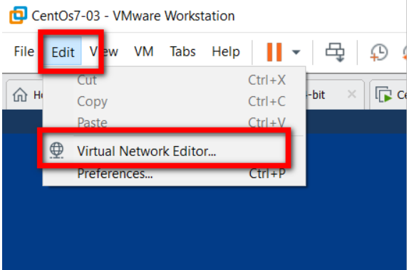
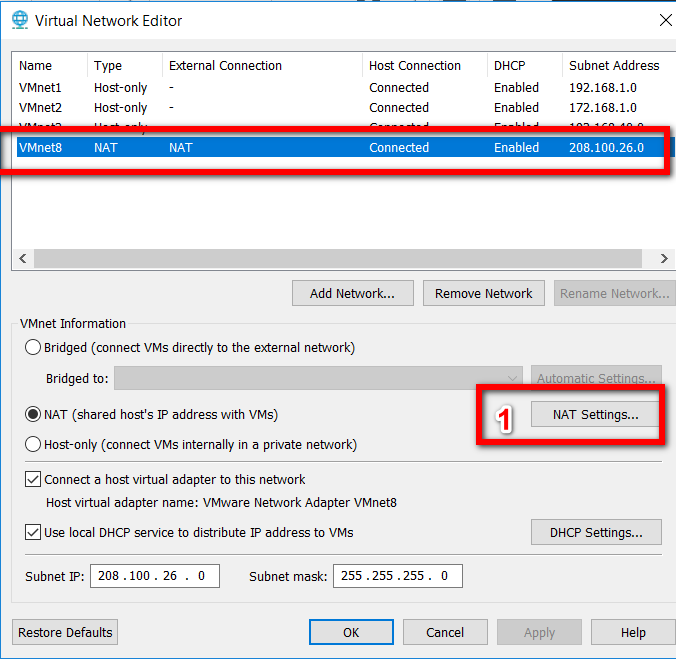
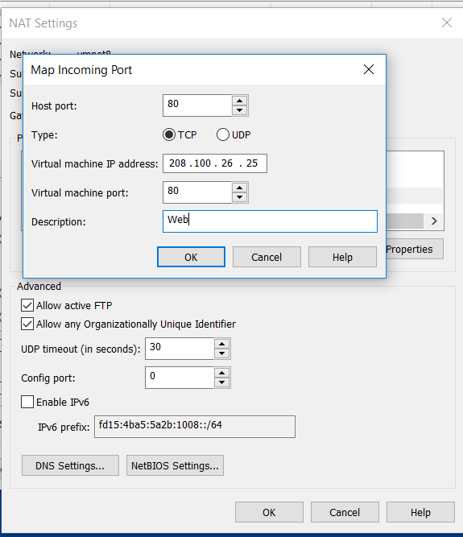

Cho phép truy cập đến VMware Virtual Machine (NAT) từ một máy tính khác.
- Nếu bạn có một máy ảo trên máy tính của bạn, 
có thể bạn muốn truy cập đến máy ảo đó từ một máy tính khác. 
Ví dụ: Bạn có một máy ảo Ubuntu với Apache chạy trên cổng 80,
và bạn muốn xem những người khác trên mạng của bạn truy cập đến website của bạn. 

- Giả sử rằng máy ảo này dùng NAT, và đăng kí địa chỉ IP là 208.100.26.25. 

Step 1: Edit / Virtual Network Editor

Step 2 : Nhấn vào thẻ NAT, sau đó nhấn Edit. Bạn sẽ thấy hộp thoại NAT Settings:

Step 3: Bây giờ bạn sẽ thấy một màn hình mà chúng ta thực sự cần. Chúng ta sẽ dùng cổng 80 trên host. Điền vào địa chỉ IP cho máy ảo CentOS, và cổng 80. Cổng này có thể là bất kì cổng nào.

- Chúng ta có thể kiểm tra thử bằng cách vào http://localhost:80 trên máy tính thật. Ngoài ra có thể thay thế localhost bằng địa chỉ IP của máy tính thật.

Chúc các bạn thành công!