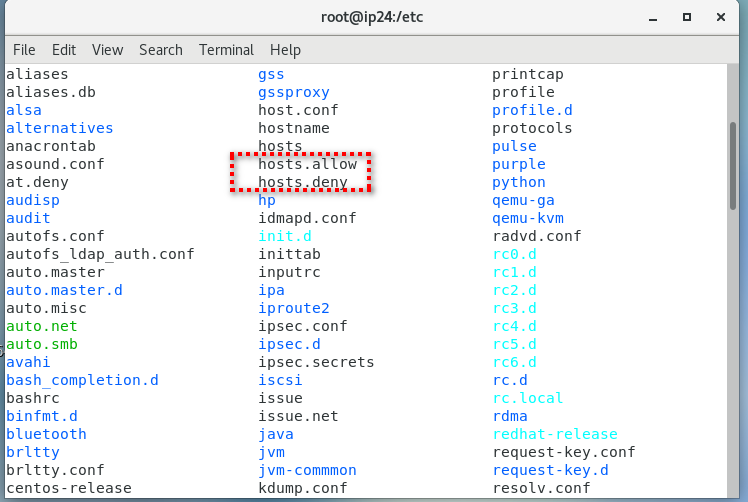

# TCP Wrappers được ứng dụng trong Linux như thế nào?

## I. TCP Wrappers là gì ?

- TCP Wrapper là danh sách điều khiển truy cập (ACL – Access Control List) dựa trên máy, và sử dụng để lọc truy cập mạng với các dịch vụ địa phương.

- Cách thức này đạt được là thông qua hai tệp nằm trong thư mục / etc. Một tên là hosts.allow và các host.deny khác.

- Ưu điểm : TCP / Wrappers có một lợi thế lớn so với tường lửa thông thường: chúng hoạt động trong lớp 7 (Ứng dụng), do đó, chúng có thể, trong số những thứ khác, có thể lọc các truy vấn ngay cả khi sử dụng mã hóa.

- Nhược điểm : Tất cả các ứng dụng dịch vụ Unix phải được biên dịch để hoạt động với thư viện libwrap. Wrappers không hoạt động với các dịch vụ gọi thủ tục từ xa (RPC) qua TCP).

## II. Cài đặtk TCP Wrappers
- Cài đặt trên CentOs7
```
yum install tcp_wrappers
```
- Cài đặt trên ubuntu
```
sudo apt-get install tcp_wrappers
```

## III. Ứng dụng hạn chết quyền truy cập vào server Linux.

### 1. Cấu hình

TCP Wrappers thực hiện kiểm soát truy cập với sự trợ giúp của hai tệp cấu hình: 

- /etc/hosts.allow và /etc/hosts.deny .Hai tệp danh sách kiểm soát truy cập này quyết định liệu các máy khách cụ thể có được phép truy cập máy chủ Linux của bạn hay không.



- /etc/hosts.allow : Tệp này chứa tên của các máy chủ được phép sử dụng các dịch vụ mạng.

- /etc/hosts.deny : Tệp này chứa tên của máy chủ không thể sử dụng dịch vụ mạng.
Nếu cùng một máy khách, người dùng hoặc ip được liệt kê trong cả hai tệp, hosts.allow có mức độ ưu tiên hơn hosts.deny, hãy cẩn thận với điều này.

### 2. Cú pháp của tệp hosts.allow và hosts.deny

- Cú pháp của các tệp này như sau:
```
list_of_service : list_of _ client [ : lệnh _ shell ]
```
Trong đó:

- service_list là danh sách các tên tiến trình của trình nền cần xem xét.

- client_list là danh sách tên máy chủ, địa chỉ IP, mẫu đặc biệt hoặc ký tự đại diện sẽ được so sánh với từng máy khách được kết nối.

### 3. Bảo mật máy chủ Linux

- Để bảo mật máy chủ Linux là chặn tất cả các kết nối đến và chỉ cho phép một vài máy chủ hoặc mạng cụ thể.
Để làm như vậy, chỉnh sửa tệp /etc/hosts.deny :
```
sudo vi /etc/hosts.deny
```
- Thêm dòng sau. Dòng này từ chối kết nối với tất cả các dịch vụ và tất cả các mạng.```
ALL: ALL
```
- Sau đó, chỉnh sửa tệp /etc/hosts.allow :
sudo vi /etc/hosts.allow
Thêm địa chỉ mạng cụ thể muốn kết nối:
```
sshd : 208.100.26.12
```

- Theo quy tắc trên, tất cả các kết nối đến sẽ bị từ chối cho tất cả các máy chủ ngoại trừ máy chủ 208.100.26.12

Kiểm tra log để xác minh.
```
cat /var/log/secure
```
- Cho phép tất cả các máy chủ ngoại trừ một máy chủ cụ thể.

- TCP Wrappers có thể cho phép các kết nối đến từ tất cả các máy chủ.
Nhưng không phải từ một máy chủ cụ thể. 

Ví du:  Để cho phép các kết nối đến từ tất cả các máy chủ trong mạng con 208.100.26. ,
Riêng máy chủ 208.100.26.12 , hãy thêm dòng sau vào tệp /etc/hosts.allow

```
ALL: 208.100.26. EXCEPT 208.100.26.12
```

Chúc các bạn thành công!

