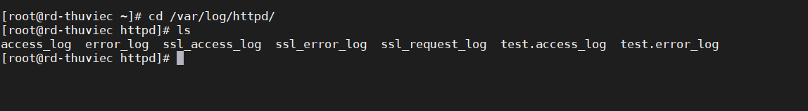
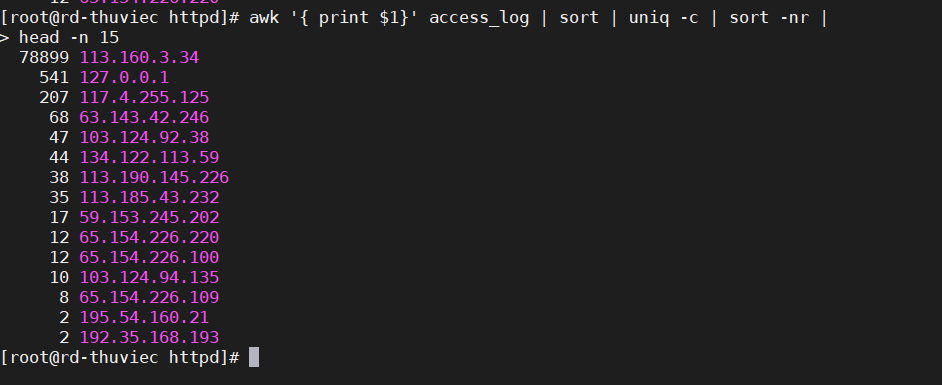

# Trace log apache - IP truy cập server nhiều nhất
### Việc giám sát log cho phép quản trị viên có thể kiểm soát truy cập , phát hiện , xử lí và ngăn chặn những mối de dọa độc hại đến từ bên ngoài.
 Giúp đảm bảo hệ thống trơn tru, hoạt động ổn định.

 - Đầu tiên , chúng ta cùng xem đường dẫn mặc định file log của Apache Web Server
 ```
 /var/log/http/access_log [For RedHat based systems]
/var/log/apache2/access.log [For Debian based systems]
/var/log/http-access.log [For FreeBSD]
 ```
 - Trong bài lab tôi sử dụng cho CentOs 7.
 Chúng ta di chuyển tới Folder httpd. Đây là nơi chứa access_log
 ```
 cd /var/log/httpd

 ```


- Tiếp theo , sử dụng đoạn lệnh sau để show 15 IP truy cập gần nhất đến máy chủ web :
```
awk '{ print $1}' access_log | sort | uniq -c | sort -nr | 
head -n 15
```


Chúc các bạn thành công!