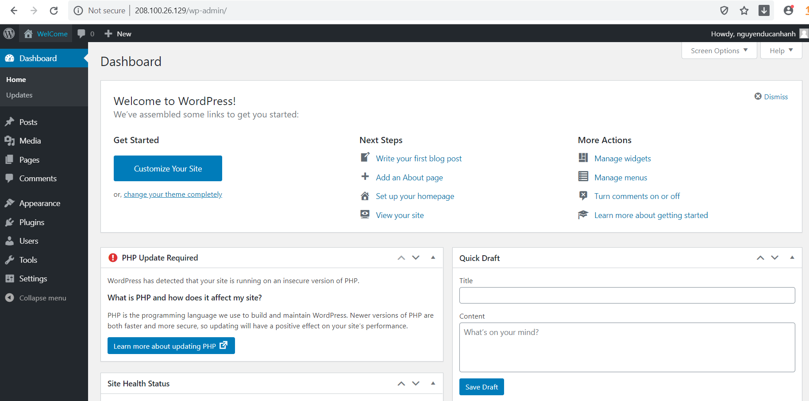

# Cài đặt WordPress trên 2 server bằng CentOS 7 (Separete Database Server)

## I. Mô hình Separete Databse Server
## II. Cấu hình trên máy SQL
## III. Cấu hình trên máy Web

# I. Mô hình Separe Database Server

- Môi trường lab : Sử dụng 2 máy ảo chạy hệ điều hành CentOS 7
```
1 máy cài WordPress 
1 máy cài Mysql server .
```
- Thông số như sau


- Các thông số card
```
- Card ens33 dùng public network (Web server , Database sau khi cài xong sẽ ngắt không cho ra internet)
- Card ens37 dùng cho mang private network (Web server, Database server)
```


## Separete Database Server

- Mô hình này tách biệt hệ thống quản lý database với phần còn lại để tránh tranh chấp tài nguyên giữa ứng dụng và database. Tính bảo mật cũng có thể tăng cường bằng cách đặt database trong một private network.


- Ưu điểm của mô hình này là hiệu suất sẽ được cải thiện do ứng dụng và database sử dụng tài nguyên riêng. Ngoài ra có thể tăng thêm tài nguyên cho server khi có nhu cầu mở rộng.

- Tuy nhiên nó đòi hỏi cài đặt phức tạp hơn mô hình all-in-one và nếu như hai server ứng dụng và database có độ trễ lớn (do khoảng cách quá xa hoặc băng thông quá thấp so với lượng dữ liệu truyền tải) thì hiệu suất sẽ bị suy giảm.

# II. Cấu hình trên máy SQL

- Trước khi cài đặt , config trên 2 server. chúng ta tắt firewll
```
systemctl stop firewalld
setenforce 0
```
## 1. CÀI ĐẶT MYSQL SERVER

- Cài đặt MySQL
```
wget http://repo.mysql.com/mysql-community-release-el7-5.noarch.rpm

rpm -ivh mysql-community-release-el7-5.noarch.rpm

yum install mysql-server
```
- Nếu máy chủ của bạn được cài đặt wget thì ta tiến hành cài đặt
```
yum install wget
```
- Start MySql Services
```
systemctl start mysqld
```
- Config bảo mật
```
mysql_secure_installation
```
Chọn Y những tùy chọn mong muốn.

## 2. Tạo database và user MySql cho Wordpress

- MySQL sử dụng database sql để lưu trữ dữ liệu, nhưng để website hoạt động được ta cần tạo user và database cho website của mình.

Truy cập vào  mysql bằng tài khoản 'root'
```
mysql -u root -p
```
Nhập mật khẩu root tạo ở trên và nó sẽ chuyển đến dấu nhắc lệnh của MySQL:
```
[root@localhost ~]# mysql -u root -p
Enter password:
Welcome to the MySQL monitor.  Commands end with ; or \g.
Your MySQL connection id is 172
Server version: 5.6.45 MySQL Community Server (GPL)

Copyright (c) 2000, 2019, Oracle and/or its affiliates. All rights reserved.

Oracle is a registered trademark of Oracle Corporation and/or its
affiliates. Other names may be trademarks of their respective
owners.

Type 'help;' or '\h' for help. Type '\c' to clear the current input statement.

mysql>
```
- Tạo database
```
mysql> create database WordPress;
```

- Tạo user và database sử dụng cho WordPress
```
mysql> create user 'user1'@'172.168.1.131' identified by 'Password!!789@';
Query OK, 0 rows affected (0.00 sec)
```
- Set quyền cho user để có quyền truy cập vào cơ sở dữ liệu.
```
mysql> GRANT ALL PRIVILEGES ON wordpress.* TO 'user1'@'%' IDENTIFIED BY 'password';
Query OK, 0 rows affected (0.00 sec)
```

- Bây giờ user đã có quyền truy cập vào cơ sở dữ liệu, thực hiện lệnh flush privileges; để MySQL cập nhật thay đổi:

```
mysql> flush privileges;
Query OK, 0 rows affected (0.00 sec)
```
- Thoát khỏi SQL
```
mysql> exit
Bye
```

# III. Cấu hình trên máy Web

## 1. CÀI APACHE

- Apache là 1 phần mềm server http phổ biến và tồn tại lâu nhất (từ năm 1995), ta dễ dàng cài đặt Apache bằng trình quản lý gói (a repository maintained) của CentOs – Yum.

Để cài đặt Apache ta sử dụng lệnh sau :
```
yum install httpd -y
```

- Sau khi cài đặt, ta khởi động dịch vụ Apache và cho phép nó khởi động cùng hệ thống :
```
systemctl start httpd
systemctl enable httpd
```

- Để kiểm tra dịch vụ ta truy cập địa chỉ ip công cộng của máy Web server trong trình duyệt Web. Ở đây địa chỉ thuộc VMnet8 là 208.100.26.129:

```
http://208.100.26.129
```
Ta sẽ thấy trang Web Apache mặc định của CentOS 7 như sau:


## 2. Install PHP

- Dịch vụ php để chạy các tập lệnh, kết nối với cơ sở dữ liệu MySQL để lấy thông tin và đưa nội dung được xử lý đến Web server để hiển thị.

- Ở đây mình muốn cài đặt php phiên bản 5.6 nên trước tiên ta phải bật kho lưu trữ EPEL và Remi cho hệ thống CentOS 7 bằng các lệnh dưới đây:
```
yum install https://dl.fedoraproject.org/pub/epel/epel-release-latest-7.noarch.rpm
yum install http://rpms.remirepo.net/enterprise/remi-release-7.rpm
```
- Tiếp theo cài đặt Yum-util để tăng cường các chức năng cũng như cung cấp cho nó các tùy chọn quản lý gói nâng cao và cũng giúp sử dụng dễ dàng hơn.
```
yum install yum-utils
```

- Sau khi cài đặt xong, ta tiến hành cài đặt php 5.6 với những lệnh sau :
```
yum-config-manager --enable remi-php56
yum install php php-mysql php-gd php-pear –y
```
Kiểm tra xem php đã được cài chưa bằng lệnh
```
php -v
```
Nhập lệnh sau để tạo 1 tệp php :
```
echo "<?php phpinfo(); ?>" > /var/www/html/info.php
```
Bây giờ ta cần khởi đông lại dịch vụ Apache để nó cập nhật module mới :
```
systemctl restart httpd
```
Vào trình duyệt Web và truy cập địa chỉ http://địa_chỉ_ip/info.php, địa chỉ của mình là 208.100.26.129 nên sẽ là như sau:
```
http://208.100.26.129/info.php
```
- Và đây là kết quả.


## 3. CÀI WORDPRESS

- Trước tiên, ta truy cập vào thư mục /var/ww/html/ sau đó tiến hành download WordPres từ internet vào thư mục này để tránh việc phải sao chép lại thư mục wordpress vào đây.

```
cd /var/www/html
wget https://wordpress.org/latest.tar.gz
```
- Sau khi tải về nó là 1 tập tin nén, ta tiến hành giải nén tập tin.
```
tar xzvf latest.tar.gz
```
- Tiếp theo, trước khi định cấu hình cho WordPress ta cần đổi tên nó thành wp-config.php. Thực hiện điều đó như sau :
```
mv wordpress/* /var/www/html/
mv wp-config-sample.php wp-config.php
```
Bây giờ ta sẽ cấu hình bằng cách thay đổi 1 số thông tin cập nhật theo cơ sở dữ liệu trong file wp-config.php .
```
vi /var/www/html/wp-config.php
```
Dưới đây là các giá trị ta cần cập nhật cho cơ sở dữ liệu :


Lưu file

- Tiếp theo ta tiến hành tắt cổng IFace ens33 trên máy sql để máy không thể đi ra ngoài mạng và chỉ sử dụng để kết nối trong local .

Vào trình duyệt Web và điều hướng đến địa chỉ ip của Web server.

http://tên_miền_or_ip_address

- Ta sẽ được chuyển hướng đến cài đặt web cho WordPress, chọn ngôn ngữ và nhấp vào Continue, sau đó tiến hành điền các thông tin cần thiết vào các trường sau đó nhấp Install WordPress .


- Giao diện quản trị Web



Chúc các bạn thành công!